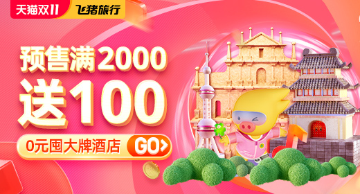

## 1.轮播图（一定是先移出，再移入。）

### 1.火车

（1）font-size = 0消除行内聚元素之间换行符引起的空格。

（2）只有下列代码中font-size:0px，才是一个圆否则是一个椭圆。<br>

```css
.btns span{

​            /* * */

​            /* border: red solid 3px; */

​            padding: 6px;

​            margin: 0 6px;

​            font-size: 0px;

​            background-color: #ffffff;

​            border-radius: 50%;

​        }
```

（3）批量操作事件。

（4）//先清空动画队列，要不然点击两次next会连续跳两张*//

​            $content.stop(true).animate

### 2.猫腻图

猫腻图，额外添加的图片。在火车的前后各插入了一张图片。先进行动画，再跳转到对应位置。主要是考虑动画的连续性。<br>

```html
<div class="content">
	<!-- 0 -->
	
    
	<!-- 1 -->
	
	<!-- 2 -->
	
	<!-- 3 -->
	
	<!-- 4 -->
	
	<!-- 5 -->
	
    
	<!-- 6 -->
	
</div>
```

```javascript
 function change(fn){
	 //先清空动画队列，要不然点击两次next会连续跳两张*//
	 $content.stop(true).animate({left:-560*index},500,function(){

	      //修改猫腻图（猫腻图，额外添加的图片）
	      if(index == 0){
	         index = 5;
	         $content.css('left',-560*index)
	     }
	     if(index == 6){
	         index = 1;
	         $content.css('left',-560*index)
	     }
	     // 按钮是从0计数的，图片是从1计数的
	     // 更新小圆点
	     $btns.eq(index-1).addClass('choose').siblings().removeClass('choose')
	     //启动轮播
	     fn && fn();               
	 })
 }
```

### 3.最后一张设置猫腻图

猫腻图，额外添加的图片。在火车的尾部插入了一张图片。向右移动时，先进行动画，再跳转到对应位置；向左移动时，先跳转到对应位置再动画。主要是考虑动画的连续性。<br>

```html
<div class="content">
	
	
	
	
	
	
 </div>
```


```javascript
 function change(fn){
  //先清空动画队列，要不然点击两次next会连续跳两张*//
  $content.stop(true).animate({left:-560*index},500,function(){
      //最后一张是猫腻图，更换成第一张
      if(index ===5 ){
          index = 0;
          $content.css('left',0)
      }
      // 更新小圆点
      $btns.eq(index).addClass('choose').siblings().removeClass('choose')
      //启动轮播
      fn && fn();
  })
}
```

```javascript
 //上一张
$('.prev').click(function(){
    //清除定时器
    clearInterval(timebar)
    //更改索引值
    index = (index+5)%6;
    //切换图片
    // 如果是第一张，要显示最后一张猫腻图
    if(index ===5 ){
        $content.css('left',-560*index)
        index = 4;
    }
    change(startInterval);
})
```

### 4.三点轮播图

若是向左移动，将下一张image放在当前image的右边，两张image同时向左移动；若是向右移动，将下一张image放在当前image的左边，两张image同时向右移动。先放好下一张，再移动。主要是考虑动画的连续性。

```html


```

```javascript
function change(fn){
	 var num=0;
	 // //先清空动画队列，要不然点击两次next会连续跳两张*//
	 $img.eq(index).stop(true).animate({left:-560},500,function(){
	     if(++num ===2 && fn){
	         fn();
	     }
	 })
	 index = (index+1)%5
	 $img.eq(index).css('left',560).stop(true).animate({left:0},500,function(){
	     if(++num ===2 && fn){
	         fn();
	     }
	 })
	 $btns.eq(index).addClass('choose').siblings().removeClass('choose')
}
 // 点击小圆点，切换图片
 $btns.click(function(){            
      //清除定时器
      clearInterval(timebar)
     var num=0;
     function end(){
         if(++num ===2){
             startInterval();
         }
     }
     //获取按钮索引值
     index1 = $(this).index();
     if (index == index1) return;
     // 如果点击右侧按钮，向左移动.如果点击左侧按钮，向右移动
     sign = index1>index?-560:560;
     $img.eq(index).stop(true).animate({left:sign},500,end)
     $img.eq(index1).css('left',-sign).stop(true).animate({left:0},500,end)
     $btns.eq(index1).addClass('choose').siblings().removeClass('choose')
     index = index1;
 })

```

### 5.碎片轮播图

先确定背景，再进行动画。主要的是为'<div class="content"></div>'创建的15个div。采用不同的动画产生不同的效果，也可以使用3D的效果。

```html
 
 
 
 
 
 <div class="content"></div>
```

```css
.content{
    position: absolute;
    top: 0;
    left: 0;
    width: 560px;
    height: 300px;
}
.content .row{
    height: 100px;
    position: relative;
}
.content .row .col{
    width: 112px;
    height: 100px;
    position: absolute;
    display: inline-block;
    /* background-color: pink; */
    /* background-size: 100% 100%; */
    /* 参考:https://www.runoob.com/cssref/pr-background-repeat.html */
    background-repeat: no-repeat;
    /* 背景image进行resize,参考：https://www.cnblogs.com/tugenhua0707/p/5260411.html */
     background-size: 560px 300px;
}

.list img{
    width: 560px;
    height: 300px;
    /* border: tan solid 3px; */
    position: absolute;
    top: 0;
    left: 0;
    display: none;
}
.list img.choose{
    display: block;
}
```

```javascript
// 通过循环创建15个div
for(var i=0;i<3;i++){
    var row = $('<div class="row"></div>');
    for (var j = 0;j<5;j++){
        var col = $('<div class="col"></div>')
        row.append(col)
    }
    $content.append(row)
}
$content.find('.col')
    .each(function(el){
        // console.log(el)
        //设置背景图片位置
        $(this).css({
            backgroundPositionX:-112*(el%5),
            backgroundPositionY:-100*parseInt(el/5),
            left:112*(el%5)
            })
        // $(this).css('border','black solid 1px')
});
```

```javascript
 function doAnimation(){
     //也可以使用其他的动画效果,例如旋转，放缩
 	$content.find('.col').css({
 	    backgroundImage:'url(../../../img/slideshow/img'+index+'.jpg)',
 	    width:0,
 	    height:0,
 	    opacity:0
 	}).each(function(){
 	    // 每一个元素设置不同时间的动画
 	    $(this).stop(true).animate({
 	         width:122,
 	         height:112,
 	         opacity:1
 	     },200+2000*Math.random())
 	})            
 	$btns.eq(index).addClass('choose').siblings().removeClass('choose')
 }
```

```javascript
 // 点击下一张图
$('.next').click(function(){
    clearInterval(timebar)
    $img.eq(index).addClass('choose').siblings().removeClass('choose')
    index = (index+1)%$img.length;
    doAnimation()
    startInterval()
})
```

